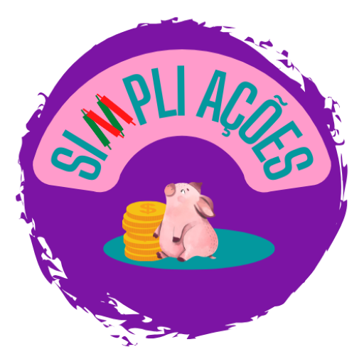

[![Contributors][contributors-shield]][contributors-url]
[![Forks][forks-shield]][forks-url]
[![Stargazers][stars-shield]][stars-url]
[![Issues][issues-shield]][issues-url]
[![project_license][license-shield]][license-url]
[![LinkedIn][linkedin-shield]][linkedin-url]

<!-- PROJECT LOGO -->
 

  

<h3 align="center">Ultimate Tic-Tac-Toe</h3>

  

    My first ReactJS experience.
    <!-- 
    <a href="https://github.com/GAlmeida150815/ultimate-tic_tac_toe"><strong>Explore the docs »</strong></a>
     
     
    <a href="https://github.com/GAlmeida150815/ultimate-tic_tac_toe">View Demo</a>
    &middot;
    <a href="https://github.com/GAlmeida150815/ultimate-tic_tac_toe/issues/new?labels=bug&template=bug-report---.md">Report Bug</a>
    &middot;
    <a href="https://github.com/GAlmeida150815/ultimate-tic_tac_toe/issues/new?labels=enhancement&template=feature-request---.md">Request Feature</a>-->
  

<!-- TABLE OF CONTENTS -->

  
Table of Contents

  <ol>
    <li>
      <a href="#about-the-project">About The Project</a>
      <ul>
        <li><a href="#built-with">Built With</a></li>
        <li><a href="#project-summary">Project Summary</a></li>
        <li><a href="#live-demo">Live Demo</a></li>
        <li><a href="#disclaimer">Disclaimer</a></li>
      </ul>
    </li>
    <li><a href="#license">License</a></li>
    <li><a href="#contact">Contact</a></li>
  </ol>

<!-- ABOUT THE PROJECT -->
## About The Project

[![Screenshot][project-screenshot]](https://github.com/GAlmeida150815/ultimate-tic_tac_toe)

### Built With

* [![React][React.js]][React-url]
* [![CSS][CSS.com]][CSS-url]

(<a href="#readme-top">back to top</a>)

<!-- Project Summary -->
## Project Summary

This project is an implementation of the Ultimate Tic Tac Toe game, created as part of the Script Languages course in my Bachelor's degree. The game consists of a 3x3 grid of Tic Tac Toe boards, where each individual game is embedded within a larger grid. Players take turns, and when a player chooses a square in a specific board (for example, top-left), the next player must play their move in the corresponding position on the next available board (e.g., top-left of the overall grid). The game continues with this rule, creating an additional layer of strategy and challenge.

Built using React, this project demonstrates my understanding of component-based architecture and state management. Features include real-time updates, game state tracking, and a responsive design to ensure smooth gameplay.

### Key Features:
<ul>
  <li>Interactive UI with React components.</li>
  <li>Dynamic game board with 3x3 Tic Tac Toe grids.</li>
  <li>Turn-based gameplay with rules that determine the next board to play.</li>
  <li>Game status tracking (e.g., win, draw, in-progress).</li>
</ul>

(<a href="#readme-top">back to top</a>)

<!-- CONTRIBUTING -->
## Top contributors:

<!-- LICENSE -->
## License

All rights reserved. You may not use, modify, or distribute this code without my explicit permission.

(<a href="#readme-top">back to top</a>)

<!-- CONTACT -->
## Contact

Gonçalo Almeida - [@__almeidaa__](https://twitter.com/__almeidaa__) - almeidagonsalo05@gmail.com

Project Link: [https://ultimate-tic_tac_toe.pt](https://ultimate-tic_tac_toe.pt)

(<a href="#readme-top">back to top</a>)

<!-- ACKNOWLEDGMENTS -->
## Acknowledgments
- [React](https://reactjs.org/) for the front-end framework
- [Bootstrap](https://getbootstrap.com/) for the UI components

<!-- MARKDOWN LINKS & IMAGES -->
<!-- https://www.markdownguide.org/basic-syntax/#reference-style-links -->
[contributors-shield]: https://img.shields.io/github/contributors/GAlmeida150815/ultimate-tic_tac_toe.svg?style=for-the-badge
[contributors-url]: https://github.com/GAlmeida150815/ultimate-tic_tac_toe/graphs/contributors
[forks-shield]: https://img.shields.io/github/forks/GAlmeida150815/ultimate-tic_tac_toe.svg?style=for-the-badge
[forks-url]: https://github.com/GAlmeida150815/ultimate-tic_tac_toe/network/members
[stars-shield]: https://img.shields.io/github/stars/GAlmeida150815/ultimate-tic_tac_toe.svg?style=for-the-badge
[stars-url]: https://github.com/GAlmeida150815/ultimate-tic_tac_toe/stargazers
[issues-shield]: https://img.shields.io/github/issues/GAlmeida150815/ultimate-tic_tac_toe.svg?style=for-the-badge
[issues-url]: https://github.com/GAlmeida150815/ultimate-tic_tac_toe/issues
[license-shield]: https://img.shields.io/github/license/GAlmeida150815/ultimate-tic_tac_toe.svg?style=for-the-badge
[license-url]: https://github.com/GAlmeida150815/ultimate-tic_tac_toe/blob/master/LICENSE.txt
[linkedin-shield]: https://img.shields.io/badge/-LinkedIn-black.svg?style=for-the-badge&logo=linkedin&colorB=555
[linkedin-url]: https://linkedin.com/in/goncaloafalmeida

[project-screenshot]: images_readme/screenshot.png

<!-- React -->
[React.js]: https://img.shields.io/badge/React-20232A?style=for-the-badge&logo=react&logoColor=61DAFB
[React-url]: https://reactjs.org/
<!-- CSS -->
[CSS.com]: https://img.shields.io/badge/CSS-20232A?style=for-the-badge&logo=css&logoColor=%23663399
[CSS-url]: https://www.w3schools.com/css/